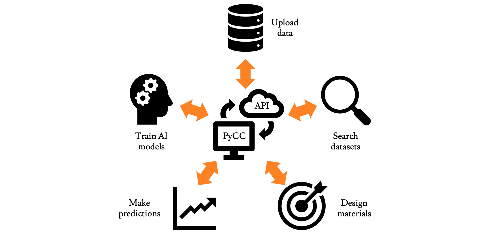

# API Examples
This folder contains examples (Jupyter notebooks) of how to interface with the [Python Citrination Client](http://citrineinformatics.github.io/python-citrination-client/index.html). You should make sure that you have Python 3 and all packages listed in [`requirements.txt`](../requirements.txt) installed properly.

## Contents
* [clients_sequence](clients_sequence) has a separate Python notebook for each sub-client of the PyCC: `DataClient`, `DataViewsClient`, `ModelsClient`, and `SearchClient`. There is also a notebook that wraps many of the endpoints together to demonstrate [sequential learning](https://citrine.io/platform/sequential-learning/).

* [tutorial_sequence](tutorial_sequence) has six notebooks organized as a sequence demonstrating the import and usage of DFT data. They discuss how to work with PIFs (including the `pypif` package), how to build search queries, and how to perform ML on Citrination.

* The other notebooks demonstrate other important aspects of the Citrination API.

## Additional resources

* Screenshot tutorials of our web UI can be found in a [separate folder](../citrination_ui_examples).
