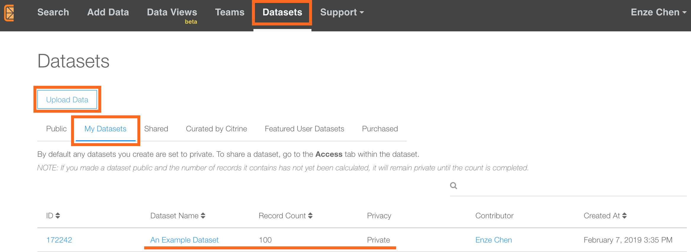
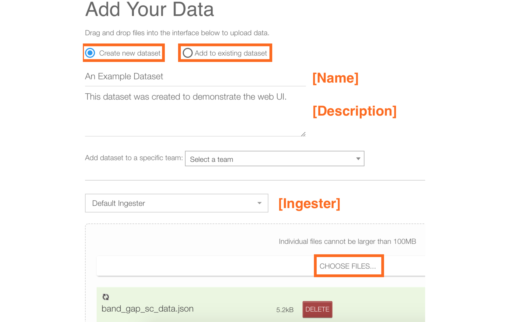
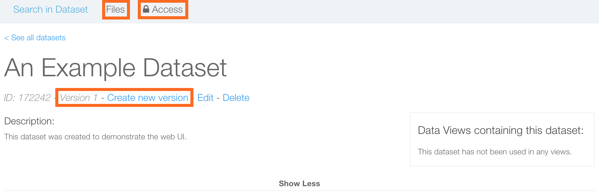
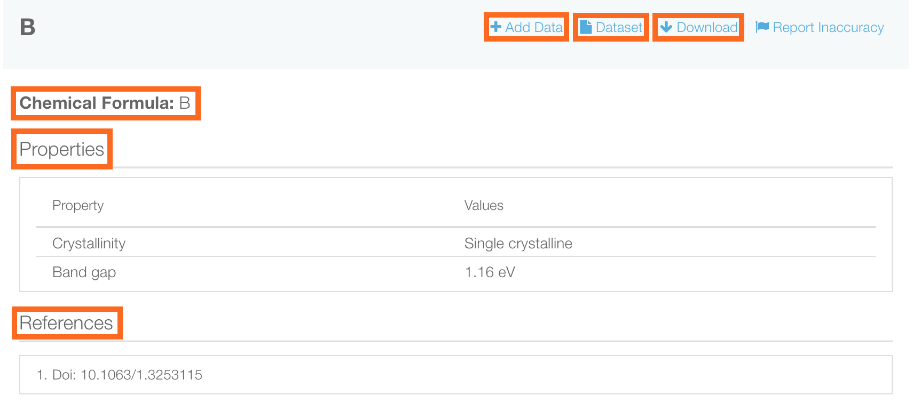

# Data Management
*Authors: Enze Chen*

In this guide, we will cover how to create datasets on Citrination, how to upload data to these datasets, and how the data is formatted on the web UI. For demonstration purposes, we will be working with a subset of the full [Band gaps from Strehlow and Cook](https://citrination.com/datasets/1160/) dataset.

## Learning outcomes
After reading this guide, you should feel comfortable with:
* Uploading new data to datasets on Citrination.
* Viewing and managing datasets on Citrination.
* Reading PIF records on Citrination.

## Background knowledge
To get the most out of this guide, it is helpful to be familiar with:
* The Physical Information File (PIF) format. This is how data is stored in Citrination, and it is our recommended format for any materials data.
  * [Documentation](http://citrineinformatics.github.io/pif-documentation/schema_definition/index.html)
  * [Publication](https://www.cambridge.org/core/journals/mrs-bulletin/article/beyond-bulk-single-crystals-a-data-format-for-all-materials-structurepropertyprocessing-relationships/AADBAEDA62B0391D708CF02269989E8B)
  * [Example](../citrination_api_examples/tutorial_sequence/AdvancedPif.ipynb)

## Datasets page
Datasets on Citrination are accessed under the **[Datasets](https://citrination.com/datasets)** menu option, which then opens the following page:   

   

You will see a row of headers describing the different categories for datasets. The category you're currently viewing is highlighted in blue, and this is Public by default. We've currently selected "My Datasets" (Private), and "Shared" includes datasets shared by members of your [Team](05_teams.md).

Down below, you will see the list of datasets that fall under the category you've selected. Each row contains:
* **ID**: The unique ID of the dataset.
* **Dataset Name**: The name of the dataset. Clicking on this will give you more information (discussed later).
* **Record Count**: The number of *PIF records* in this dataset. If you just uploaded data to a dataset, then this number is likely inaccurate as it takes time for records to be processed.
* **Privacy**: Whether this is a Public (everyone can see) or Private (not everyone can see) dataset.
* **Contributor**: The username of the person who created the dataset.
* **Created At**: A timestamp for when the most recent version of the dataset was created.

## Upload data
If this is your first time on the Citrination platform, then "My Datasets" is likely empty for you. Let's change that by uploading some data! Click the "Upload Data" button found near the top of the page, which will take you to same page that opens if you had clicked "[Add Data](https://citrination.com/add_data)" in the black menu bar:   

Going through the items from top to bottom, the first choice to make is to decide if you're adding data to a new dataset (which must be created) or to an existing dataset.

### New dataset
If you choose this option, boxes will appear where you can give the dataset a name and description. It is generally a good idea, at least in the description, to elaborate on where the data came from, what it could be used for, whether it's computational or experimental data, and the like. You can also choose to share the dataset with a specific [Team](05_teams.md) that you're in. New datasets are by default *Private*.

### Existing dataset
If you choose this option, the three options we just discussed are replaced by a dropdown menu that lists all the datasets you have access to. You then choose the dataset which you want to add data to.

### Ingester
[Ingesters](https://help.citrination.com/knowledgebase/articles/1195249-citrination-file-ingesters) are Citrine-proprietary tools that turn materials data, which come in all forms, into PIF records that can be processed by our platform. We are continually increasing the number of ingesters we have in order to support more file formats. Currently supported file formats that are commonly used by the materials community include:
* [CSV](https://help.citrination.com/knowledgebase/articles/1188136) - Comma Separated Values
* PIF - Physical Information File
* [CIF](https://help.citrination.com/knowledgebase/articles/1200448) - Crystallographic Information File
* [VASP](https://help.citrination.com/knowledgebase/articles/1804075) - Vienna Ab initio Simulation Package
* [Espresso](https://help.citrination.com/knowledgebase/articles/1804069) - Quantum Espresso DFT calculations
* [XRD](https://help.citrination.com/knowledgebase/articles/1804294) - X-ray Diffraction .xrdml files
* [PDB](https://help.citrination.com/knowledgebase/articles/1811464) - Pandat phase diagram calculations

If you want the data that you upload to be processed into PIF records, you have to choose the correct ingester at this step (each ingester only works with one input file type). We will walk through two examples below.

### Choose files
The final step is to choose the files containing the data you want to upload. As noted above, you have to choose files that contain data in the same format (all PIFs, all CSVs, etc). Each file can store multiple PIF records. You may upload files of any format to be stored on Citrination, although if they don't match the ingester then they will not get processed.

### YOUR TURN
The data for this example is stored in the `data` folder in this directory.   
1. You should create a new dataset and choose a name ("An Example Dataset," perhaps) and description.
2. Choose the "Default Ingester," which takes PIF JSON files and converts them into PIF records.
3. Choose the `band_gap_sc_data.json` file, which should have 11 PIF records. This dataset is a subset of the full [Band gaps from Strehlow and Cook](https://citrination.com/datasets/1160/) dataset.
4. Click "Submit Files."

## Dataset info page
Congratulations on adding data to your first dataset! When you click submit, you will be automatically redirected to the Dataset info page, which is shown below. This is the same page you would have arrived on by clicking the Name of the dataset on the [Datasets](https://citrination.com/datasets) page.   

   

At the top of this page, you will see the name and description you gave this dataset during the creation phase. The "Edit" button underneath the name allows you to change these two fields.

You will also notice a dataset ID number that is assigned to this dataset. In between the ID number and the "Edit" button is the version number. Newly created datasets will be Version 1, and it increases by 1 each time "Create new version" is pressed. Note that creating a new version will **delete** all the *files and PIF records* in the dataset (the dataset and its unique ID remain), so handle with care. "Delete" will remove the entire dataset and any associated PIFs.

 Down below, on the "Search in Dataset" page, you will see a similar search interface as the main page, just with the PIF records limited to those in this dataset. You should see 11 PIF records at the moment, one for each system in the PIF you uploaded. The box on the right lists all the [Data Views](03_data_views.md) that include this dataset.

At the top, "Files" lists all the files in this dataset, including information on who contributed them, their ingest status, and the option to delete them. There is an "Add Files" button that we will return to shortly.

Moving across the top, we come to the "Access" button. On this page you have the option of changing the Privacy settings of your dataset as well as sharing the dataset with different [Teams](05_teams.md). We encourage you to make new datasets **Public** to promote open science and support materials informatics research. Our data management principles can be found [here](https://citrination.com/datamanagement).

### YOUR TURN
11 PIF records are not that many. Let's add some more!    
1. Navigate to the "Files" tab and click "Add Files." Alternatively, click "Add Data" in the black menu bar.
2. Select "Add to existing dataset" and select the dataset you just created.
3. This time, instead of uploading PIFs, we will upload a CSV. Therefore, select the "[Citrine: Template CSV](https://help.citrination.com/knowledgebase/articles/1188136)" ingester from the dropdown menu. Pay attention to the header row formatting, which is important for ingestion to work properly. Empty cells in the CSV will be safely ignored by the ingester.
4. Choose the `band_gap_sc_data.csv` file, and submit for upload.

You will be redirected to the "Files" page of the dataset you selected, where you can see an additional CSV in the list of files. After waiting for a bit, you should start to see the extra PIF records, one for each row in your CSV, populate the search page. The total number should increase to 100. This is an example of how you can supplement an existing dataset with newly discovered data from the literature or experiments.

## PIF record
If you click on any PIF record on the search page, an image like the one below should appear:   

    

The Chemical Formula will appear at the top, followed by Properties in an organized table, and then References. The three buttons at the top do the following:
* **Add Data**: You can add more properties to this PIF and multiple versions will be created and saved in the history. The `uid` (found in the URL) of the PIF remains the same. This is *typically* not used since it is rare that only a single PIF in a dataset needs to be updated, and most users would just update the whole dataset.
* **Dataset**: Clicking this returns you to the Dataset info page for the dataset that contains this particular PIF record.
* **Download**: Clicking this will download this individual PIF record.

## Conclusion
This concludes our discussion of how to manage datasets on the Citrination platform. As mentioned earlier, you should now feel comfortable with:
* Uploading new data to datasets on Citrination.
* Viewing and managing datasets on Citrination.
* Reading PIF records on Citrination.

When you're ready to move on, feel free to look at either the [Data Views](03_data_views.md) or [Search](04_search.md) guides. If you have further questions, please do not hesitate to [Contact Us](https://citrine.io/contact/).
