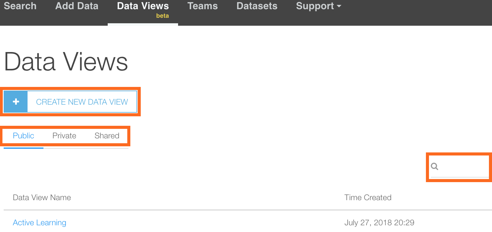
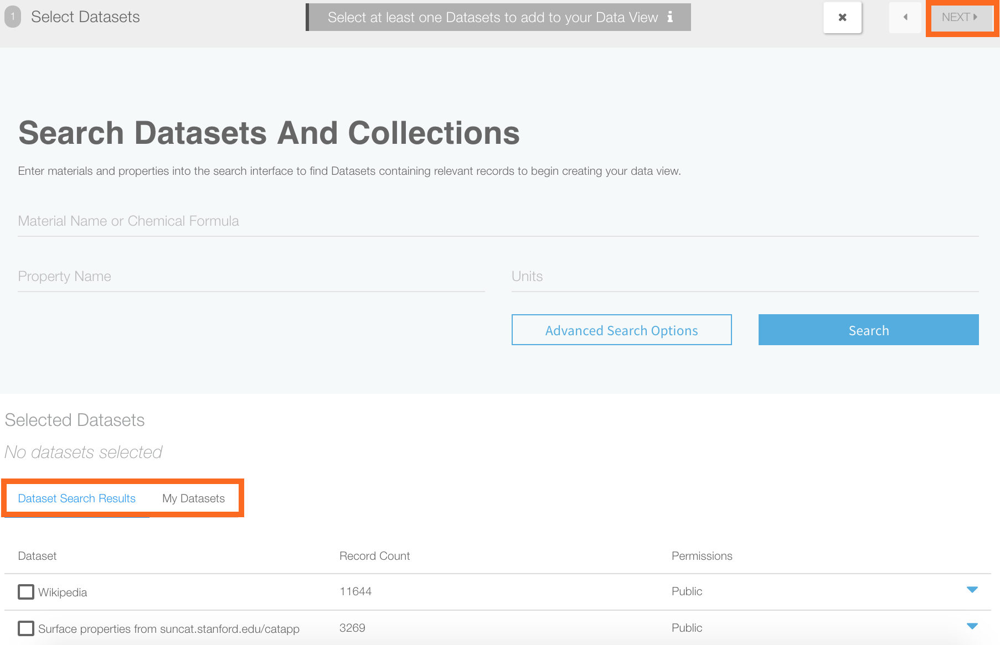
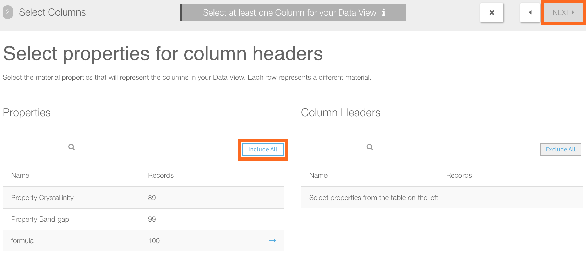
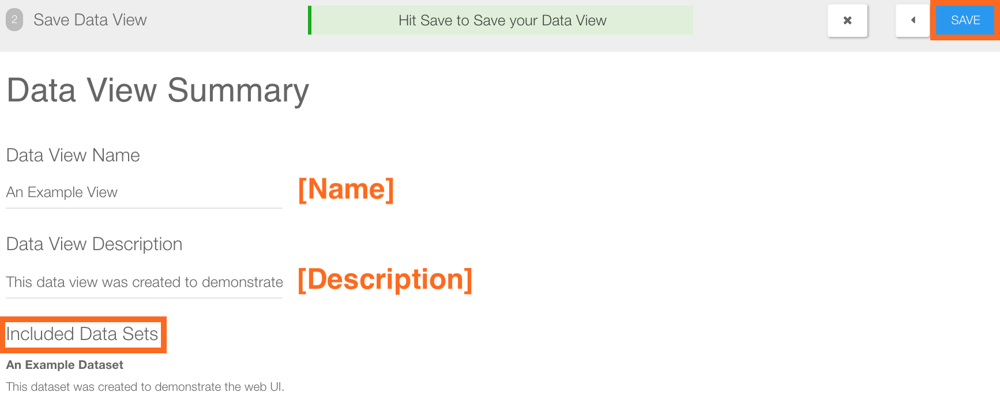
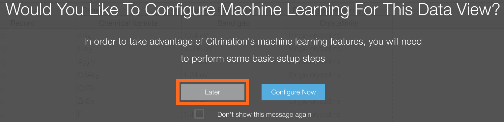
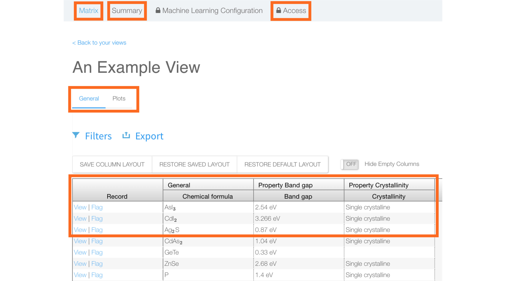
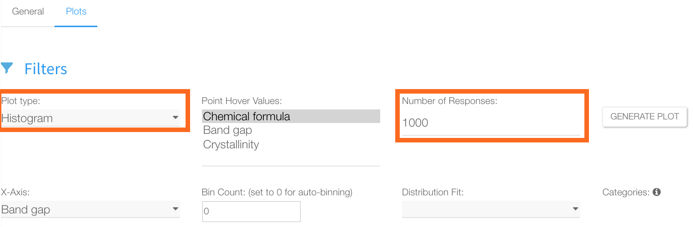

# Data Views
*Authors: Enze Chen*

In this guide, we will cover how to create a Data View ("View" for short) on Citrination using the web UI. Views provide a way for users to aggregate the information in a dataset(s) and present it in a more visually appealing way (matrix, plots, etc.). Views also enable [machine learning (ML) services](06_machine_learning.md), which we will cover in a later guide.

## Learning outcomes
After reading this guide, you should feel comfortable with:
* Creating new Views using the Citrination UI.
* Inspecting data in matrix and plots formats.

## Background knowledge
To get the most out of this guide, it is helpful to be familiar with:
* The Physical Information File (PIF) format. This is how data is stored in Citrination, and it is our recommended format for any materials data.
  * [Documentation](http://citrineinformatics.github.io/pif-documentation/schema_definition/index.html)
  * [Publication](https://www.cambridge.org/core/journals/mrs-bulletin/article/beyond-bulk-single-crystals-a-data-format-for-all-materials-structurepropertyprocessing-relationships/AADBAEDA62B0391D708CF02269989E8B)
  * [Example](../citrination_api_examples/tutorial_sequence/AdvancedPif.ipynb)
* [Datasets](02_data_management.md) on Citrination.

## Data Views page
Views on Citrination can be accessed through the "[Data Views](https://citrination.com/data_views)" menu option, which takes you to the page below:   

   

This page has three subheadings that lists all the Views shared publicly, privately, and within teams. You can search for specific Views using the search bar on the right, and clicking on the name of the View will take you to the main page for that View. Assuming you're here for the first time, we'll go ahead and click **Create New Data View**.

## Creating a new View
Since Views are built from datasets, the first step in Views creation is selecting which datasets should be included.   

   

You have the option to search for specific datasets and select the relevant ones by clicking the boxes on the left. The UI will display how many PIF records are in each dataset. After you have selected at least one dataset, the "NEXT" button at the top will turn blue and clicking it will take you to the next page. For now, click on "My Datasets" and try to find the example dataset that you created with the Strehlow and Cook subset data.

### Select columns
   

From the datasets, Citrination will extract the chemical formula and properties that appear, along with the number of PIF records that have each property (though not how the counts correspond). You have to select at least one of the properties to be a column in your View, and the "Include All" button is a shortcut for selecting everything. After you've selected the desired columns, which should be all of them in this example, the "NEXT" button will be enabled, taking you to the next page.

### View summary
   

The next page is the View summary, where you can give your View a name and description. It also shows which datasets are included in this View, so that is a good sanity check. You will have the option to edit the name and description fields later, so pick something you can remember for now (e.g. "An Example View"). When everything looks good, you must click "SAVE" to finish making the View.

### Configure ML
At this point, the UI will turn dark and the following pop-up will appear:   

   

You have the option of training ML models now, or later. Since this is a fairly involved process, we'll cover it in [a subsequent guide](06_machine_learning.md). Just select "Later" for now.

## View matrix
Congratulations on making your first View! If you're not automatically redirected to the View, then you should be able to find it in your list of [Data Views](https://citrination.com/data_views). The first page that pops up should be the matrix display:

Here, each PIF record is displayed as a row in the table, and each property that you configured for the View is its own column. If a PIF record is missing a property, then that cell is blank. Individual PIF records can be accessed with the "View" button in each row.

At the top, there are the following options:
* **Summary**: This shows the same summary information during View creation, and you'll have the option of editing the name and description.
* **ML Configuration**: This allows you to configure ML and train models using this View.
* **Access**: This gives you the option of changing the Privacy settings of your View.

## View plots
Under the View name, the "Plots" tab leads to a page like the following:

There are many different plot types that you can choose from, including line plots, scatter plots, and histograms. The "Point Hover Values" specifies what information is displayed when your cursor hovers over a data point, and "Number of Responses" specifies how many data points to show. Depending the plot type, the subsequent settings will change.

In this example, we will plot a histogram of band gap values in this dataset, so we select "Band gap" for the *x*-axis. This produces a plot (backed by [Plotly](https://plot.ly/)) that looks like the following:

## Conclusion
This concludes our discussion of how to create Data Views on the Citrination platform. As mentioned earlier, you should now feel comfortable with:
* Creating new Views using the Citrination UI.
* Inspecting data in matrix and plots formats.

When you're ready to move on, the next step will be to [Configure ML](06_machine_learning.md)!

If you have further questions, please do not hesitate to [Contact Us](https://citrine.io/contact/).
