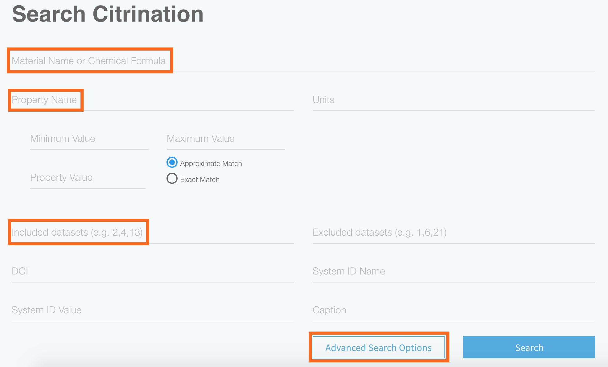
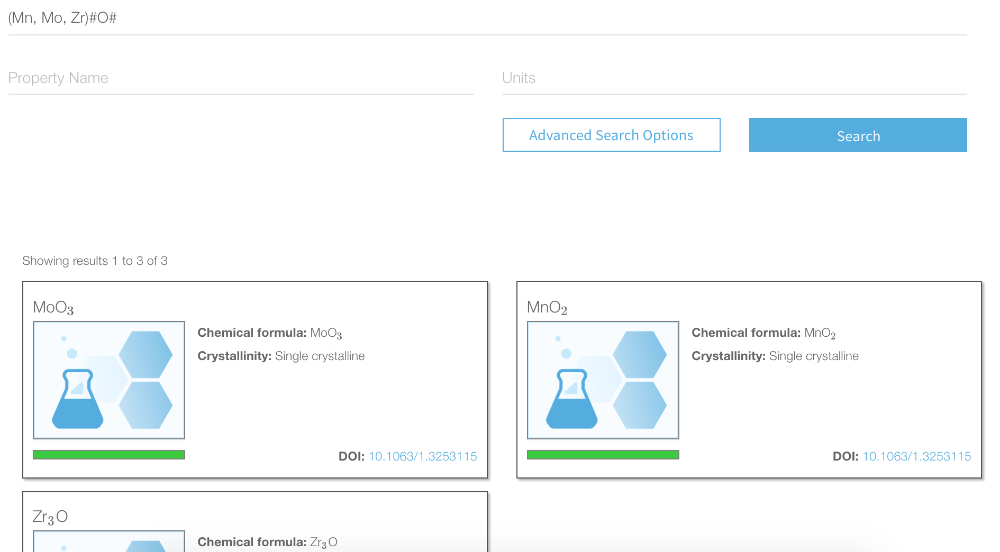
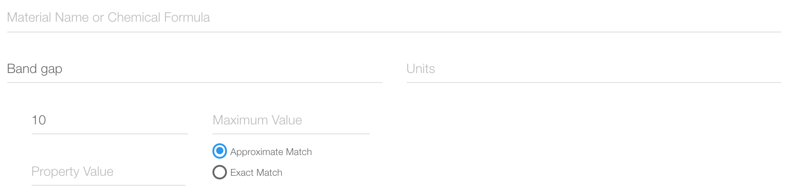

# Search
*Authors: Enze Chen*

In this guide, we will cover how to search for data on Citrination using the web UI.

## Learning outcomes
After reading this guide, you should feel comfortable:
* Searching for PIF records using the Citrination UI.

## Background knowledge
To get the most out of this guide, it is helpful to be familiar with:
* The Physical Information File (PIF) format. This is how data is stored in Citrination, and it is our recommended format for any materials data.
  * [Documentation](http://citrineinformatics.github.io/pif-documentation/schema_definition/index.html)
  * [Publication](https://www.cambridge.org/core/journals/mrs-bulletin/article/beyond-bulk-single-crystals-a-data-format-for-all-materials-structurepropertyprocessing-relationships/AADBAEDA62B0391D708CF02269989E8B)
  * [Example](../citrination_api_examples/tutorial_sequence/AdvancedPif.ipynb)
* [Datasets](02_data_management.md) on Citrination.

## Search page
The [Search page](https://citrination.com/search/simple) is the default page when accessing Citrination, and the following options appear when you click on "Advanced Search Options":

  

As you can see, there is tremendous flexibility in how search queries are constructed. With the large amount of data on our platform, this will help you narrow down your options to obtain exactly the data you need. Some important fields to note are:
* **Material Name or Chemical Formula**: This will return all PIF records that match the name or formula.
* **Property Name**: This will return all PIF records that have the specified Property.
  * Names are *case-insensitive*, but wildcard searches (using asterisks) are *not* allowed.
* **Included datasets**: This will only search among the records in the specified datasets.
  * If you're only searching through one dataset, you can also use the search functionality on that dataset's page.

When "Search" is pressed, any relevant PIF records are returned at the bottom.

## Examples
We will use the dataset we uploaded in a [previous tutorial](02_data_management.md) to demonstrate the search functionality. If you navigate to that dataset's page, and input `MnO2` in the "Material Name" field, you should see a single PIF result for manganese(IV) oxide appear. More complex searches can be constructed as well, such as `(Mn, Mo, Zr)#O#`, which will search for all oxides with manganese, molybdenum, and zirconium in any oxidation state. More details on wildcard searches can be found in the [Citrination Knowledge Base](https://help.citrination.com/knowledgebase/articles/1838953-search-special-characters-and-wildcards).

Now we will search by property to find high band gap materials in this dataset. Clear the "Material Name" field and enter `Band gap` for the "Property Name." Click "Advanced Search Options" and enter `10` for the Minimum Value. When you press enter, you should see three PIF records appear (CaF2, LiF, BeO), corresponding to materials in this dataset with a band gap higher than 10 eV.

## Conclusion
This concludes our discussion of how to search for data using the Citrination UI. If you have further questions, please do not hesitate to [Contact Us](https://citrine.io/contact/).
