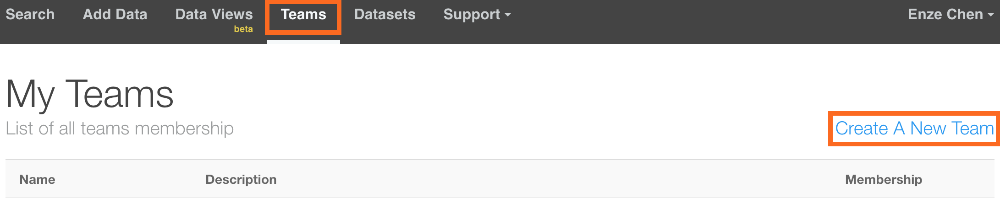
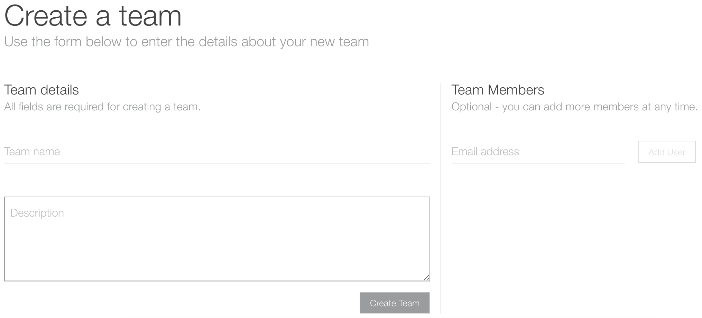
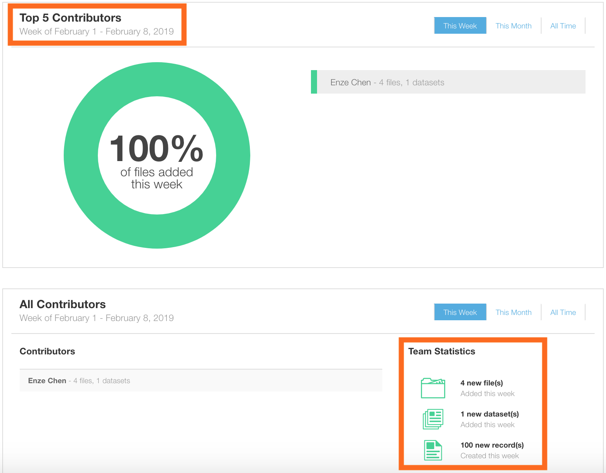
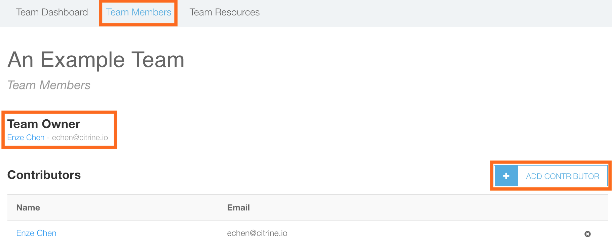
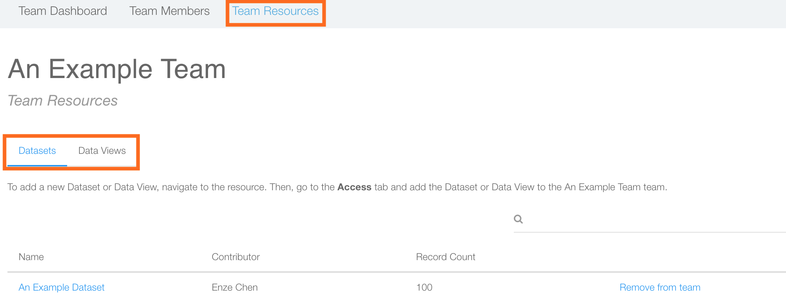

# Teams
*Authors: Enze Chen*

In this guide, we will cover how to create Teams on Citrination using the web UI. Teams allow you to share datasets and data views among a select group of people without having to make your resource Public to everyone. On the [Teams page](https://citrination.com/teams) you can also monitor contributions and the types of resources shared with the team.

## Learning outcomes
After reading this guide, you should feel comfortable:
* Creating new teams on Citrination.
* Adding datasets and data views to teams.

## Teams page
Clicking the "Teams" menu option will take you to the main page:

The page lists all the teams you are in, including your affiliation (Member or Owner). To create a new team, click **Create A New Team** in the top-right corner.

### Create a new team

Teams are required to have a name and description. At this point, you also have the option of adding team members, but this can also be done later. When you're all set, click "Create Team" to create the team.

## Team dashboard
The main page is the Dashboard, which looks like the following:

The top half displays the top 5 contributors by percentage, and you can select between the time ranges of Week, Month, or All Time. The bottom half also lists contributors and statistics, such as the total number of files, datasets, and PIF records.

## Team members
The next tab on your team page is the Members list.

On this page, you can see the team owner and members. You also have the option to add more contributors by clicking the button on the right.

## Team resources
The third tab lists resources shared with the team. This includes datasets and data views, which are toggled by the subheading on the resources page, as shown below:

Clicking on the name of the resource will take you to that resource's page. As described in the image above, you must use the **Access** page for each resource in order to add that resource to a team. This slightly involved step helps prevent data from accidentally being shared with the wrong parties.

## Conclusion
This concludes our discussion of how to create and manage Teams using the Citrination UI.  If you have further questions, please do not hesitate to [Contact Us](https://citrine.io/contact/).
