# Machine Learning
*Authors: Enze Chen*

In this guide, we will cover how to configure a machine learning (ML) model from a data view using the Citrination web UI. ML is a process that programmatically identifies relationships in your data between a set of inputs and a set of outputs. The Citrination platform simplifies the user experience and generates powerful ML models with informative reports for analysis. Building a ML model also enables [Prediction and Design](07_predict_design.md), which is covered in a later guide.

## Learning outcomes
After reading this guide^, you should be familiar with:

* Choosing the set of inputs and output for a ML model.
* Assessing model quality through Model Reports.     

^ *Note*: This guide is *quite dense* and will likely take many read-throughs before things start to click. There are many external links for context, but they are not essential (you can ignore them if they're distracting) and you should not feel like you have to understand everything right away. Turns out, ML is [h](https://machinelearningmastery.com/applied-machine-learning-is-hard/)[a](https://developers.google.com/machine-learning/problem-framing/hard)[r](http://ai.stanford.edu/~zayd/why-is-machine-learning-hard.html)[d](https://www.forbes.com/sites/janakirammsv/2018/01/01/why-do-developers-find-it-hard-to-learn-machine-learning/#7d62eccf6bf6); when applied to materials science, it might be [even harder](https://youtu.be/28Ue_jteKI4?t=254).

## Background knowledge
To get the most out of this guide, it is helpful to be familiar with:
* How to create [data views](https://citrination.com/data_views/) on Citrination ([guide](03_data_views.md)).
* Basic machine learning. This is understandably vague and requires prerequisites in and of itself.
  * [This YouTube video](https://www.youtube.com/watch?v=nWk6QlwvXok), made by Julia Ling, gives an introduction to ML for materials science.
  * [This visual](http://www.r2d3.us/visual-intro-to-machine-learning-part-1/) is also a gentle introduction.

## Configure ML
You might recall in the [Data Views guide](03_data_views.md) that we deferred configuring ML services at the time—this guide picks up right where we left off. If you navigate to the view you created, and click on "Machine Learning Configuration," you will be asked to set column types for each of the properties in your view.

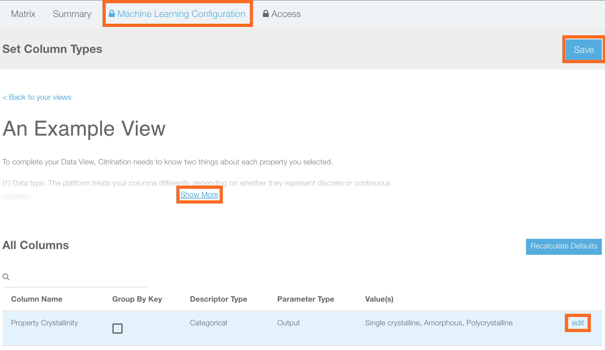

### The reason for columns
Those who are new to ML might not understand why we need to configure "columns" instead of "rows," let alone columns at all. This is because traditionally, when data is arranged into a tabular format, the rows will represent individual material candidates and the columns will represent the properties of each candidate. This is standard ML paradigm. Since ML is trying to learn the relationship between input properties and output properties, we have to specify which columns should be used and what role each one serves.

### Set column types

It is helpful to expand the description ("Show More") and read about the various parameters on this page. On the bottom of that page, each property is listed with its **Descriptor Type** (Categorical, Real, Organic, Inorganic, Alloy), **Parameter Type** (Input, Output, Latent variable, Ignore), and **Values**. If you would like to change a setting, click "edit" next to the corresponding property. You need to have at least one input and at least one output (this is the [supervised learning](https://bigdata-madesimple.com/machine-learning-explained-understanding-supervised-unsupervised-and-reinforcement-learning/) paradigm).

For this tutorial, we'll edit "Property Crystallinity" because we want it as an Input rather than an Output. Specifically, we will use Chemical Formula (Inorganic) and Crystallinity (Categorical) to predict the Band Gap (Real).

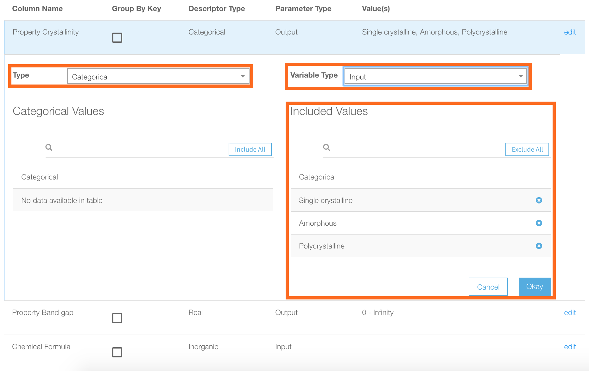

The above menu will open up, allowing you to change the Variable Type to "Input." Depending on the Descriptor Type, this menu will show different options. *Categorical* descriptors will have all the categories listed for you to include (all are included by default), while *Real* descriptors will have a range of values for you to include. The *Group By Key* checkbox determines if your data will be grouped by that property when constructing folds for cross-validation. 

When you're all done, click "Okay" to collapse the menu, and finally **Save** at the very top.

## Model training
*Training* is the term that refers to a ML model learning the relationships in the data. In the background, Citrination trains a ML model to fit the data based on the chosen inputs and outputs. Blue progress bars will display at the top of your screen indicating which step of the training process it's currently on.

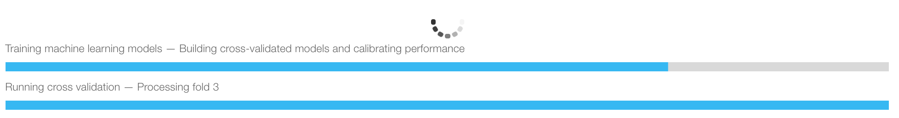

Green boxes will appear at the top of the page to inform you of when certain services are ready. Some services, like Model Reports, take longer than others, like Predict services. While you're waiting, if you navigate to the **Summary** page for your view, you will see the column headers listed with their configured settings for ML. You can always return to the **Configuration** page to change the property types.

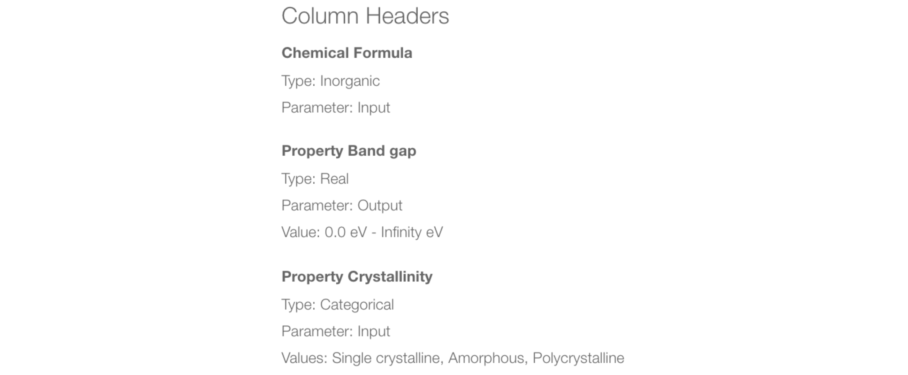

## Model reports
When your model has finished training, you can view the model properties and statistical summaries on the **Reports** page.

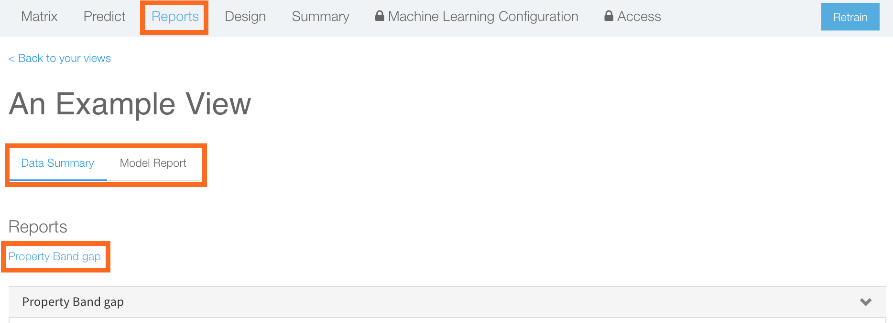

### Feature statistics

The "Data Summary" page will load by default and show two plots for each *output* property. The first plot is a bar chart of [Pearson correlation coefficient](https://www.spss-tutorials.com/pearson-correlation-coefficient/) values, which measure the linearity in the relationship between each input feature and the output variable. A value of `-1` indicates a perfectly negative linear relation, a value of `1` indicates a perfectly positive linear relation, and a value of `0` indicates no linear relation. The correlation coefficient can help you build intuition about the dependence of the output on individual features. Note, however, that:
1. There can still be *non-linear* and compound relationships in your data that are not captured here.
2. [Correlation between input-output does not imply causation](https://towardsdatascience.com/why-correlation-does-not-imply-causation-5b99790df07e).

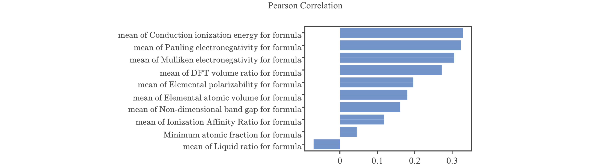

You will also notice that the input we selected was "Chemical Formula," but the actual features that were generated are statistical metrics over elemental properties such as "electronegativity" and "atomic fraction." These are borrowed from the [Magpie](http://oqmd.org/static/analytics/magpie/doc/) library and explained in [this paper](https://www.nature.com/articles/npjcompumats201628).

The second figure on the "Data Summary" page is a **t-SNE** plot, which is short for t-Distributed Stochastic Neighbor Embedding. As you saw above, materials tend to live in *high-dimensional space*, meaning that there are tens to hundreds of features used to represent a material, and it is impossible to visualize such high-dimensional space. Therefore, we employ t-SNE as a *dimensionality reduction* technique to project the data onto 2 dimensions for ease of visualization, as shown below.

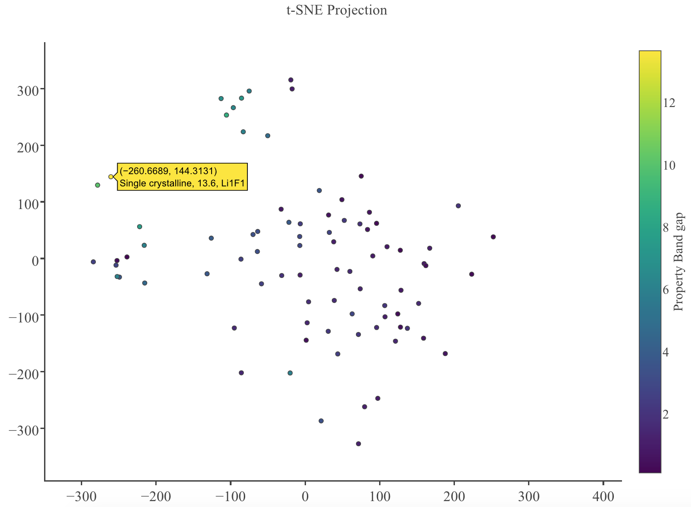

This technique was developed about [a decade ago](https://lvdmaaten.github.io/tsne/) ([simpler explanation](https://www.analyticsvidhya.com/blog/2017/01/t-sne-implementation-r-python/)) and it's a powerful projection tool because nearby points in high-dimensional space remain close in 2D while distant points remain far apart. The points in our plot are color-coded based on the property value (as indicated by the color bar), and you can hover over each data point to obtain more information such as the chemical formula. t-SNE plots are helpful for identifying clusters and structures in your data. Note that because the t-SNE plot is stochastic (i.e. random), it will change if you retrain your Data View.

### Model performance
Next we switch over to the "Model Report" tab, which displays how well your model performed at predicting each output variable from the set of inputs you provided. Let's expand the "Property Band gap" header.

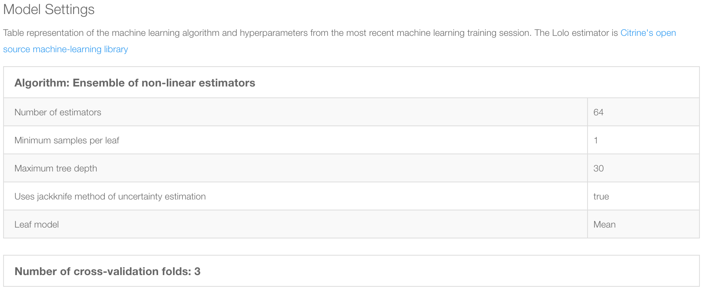

Under **Model Settings**, you will find the parameters used to fit the ML model. All of these settings are chosen automatically to give the best performance, and the two that we want to highlight in particular are:
* **Jackknife uncertainty estimation**: When set to *true*, this means the [jackknife method](http://jmlr.org/papers/volume15/wager14a/wager14a.pdf) is used to estimate the variance, and thereby uncertainty, in the estimators.
* **Cross-validation folds**: [Cross validation](https://towardsdatascience.com/cross-validation-70289113a072) (CV) is an important technique in machine learning to determine model hyper-parameters and assess model effectiveness for extrapolation. *k*-fold CV refers to splitting the data into *k* groups, training on *k-1* groups, validating on the last group, and repeating this validation *k* times for each group left out.

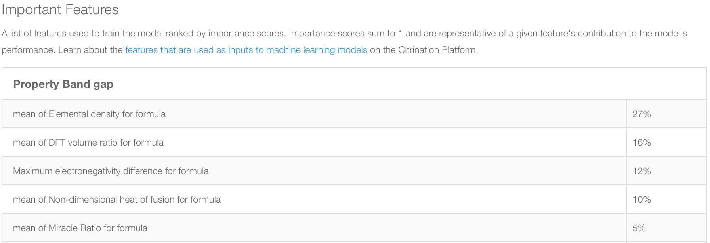

Following the model settings is a ranked list of important features, calculated based on their contributions to the final prediction. This list is illuminating and informative both in the ways that it matches physical intuition (like "Maximum electronegativity difference") and in the ways that it deviates (therein lies the power of ML).

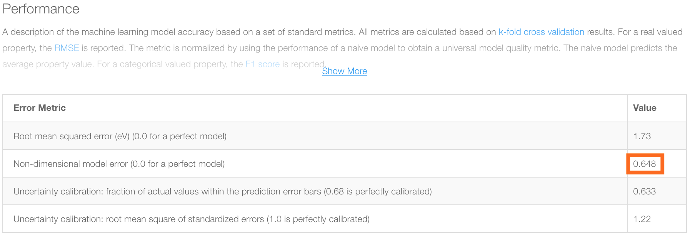

Finally, we arrive at the model performance table, which gives four metrics that quantify the model performance. It's recommended to click on "Show More" and read through the explanations. Here, we will explain what each of the values means and what the ideal values correspond to.
* **Root-mean-square error (RMSE)**: This value, in units of the predicted variable, measures the difference between predicted and actual values. We want this value to be as small as possible (hence 0.0 is ideal), and the magnitude is property and units dependent.
* **Non-dimensional model error (NDE)**: This value, boxed because it is arguably the most important metric, measures how your model performs against a naive model that guesses the mean value each time. The RMSE from your model is divided by the RMSE of the guess-the-mean model and this value is reported.
* **Uncertainty: Fraction of actual values**: This value counts how many of the error bars, centered around the predicted value, include the actual values (green line below). Because the error bars represent 1 standard deviation, an ideal fraction, assuming normally distributed errors, is 0.68.
* **Uncertainty: RMS of standard errors**: This value represents the error after scaling the predicted values and is ideally 1.0 for a true Normal distribution.

### Performance plots

At the bottom of the page, we display two plots to visualize the model performance.

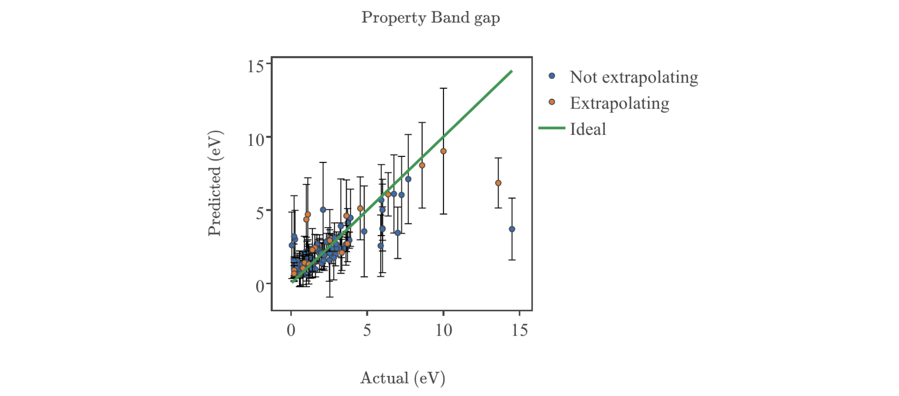

The first is a **Predicted vs. Actual plot**, or **parity plot**, which plots the values predicted by the model against the actual values from the data. The error bars represent +/- one standard deviation, and the green line represents the ideal behavior where every prediction matches the actual value. "Extrapolating" values are for examples that are sufficiently different from the training data (based on a proprietary metric), while "Not extrapolating" values are examples that are similar to the training data and *typically* exhibit higher predictive accuracy. This plot is interactive, so you can hover over the points to reveal more information, zoom in/out, and click in the legend to reveal/hide different sets of points.

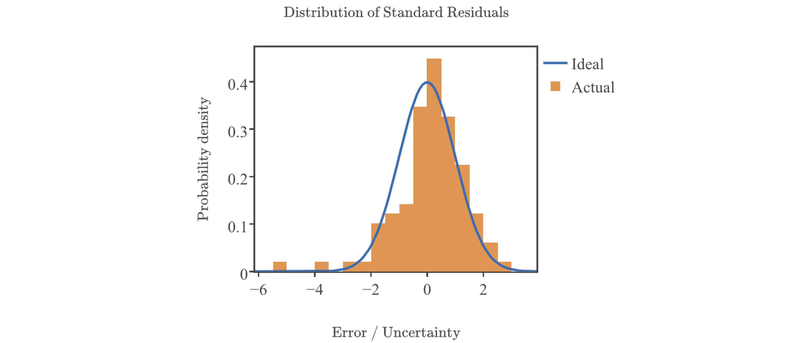

The second plot is a distribution of residuals, which is the signed difference (prediction - actual). This gives another visual interpretation of our model, in the hopes that for many cases, our errors are small and normally distributed around 0. The orange bars contain all the residuals and the blue curve is a normal distribution fit to the bars.

## Conclusion
Ta-da! This concludes our discussion of ML on Citrination. At this point, you should be familiar with:
* Choosing the set of inputs and output for a ML model.
* Assessing model quality through Model Reports.

With your ML model in hand, you're now equipped to perform [Prediction and Design](07_predict_design.md) services through the UI. These are core elements of [Citrine's sequential learning framework](https://citrine.io/platform/sequential-learning/) and enable you to leverage the power of materials informatics to do better research, faster. As always, if you have further questions, please do not hesitate to [Contact Us](https://citrine.io/contact/).
