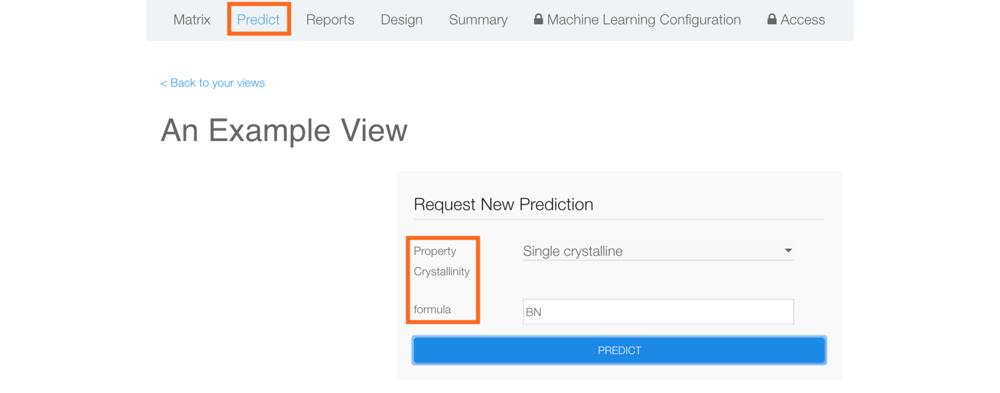
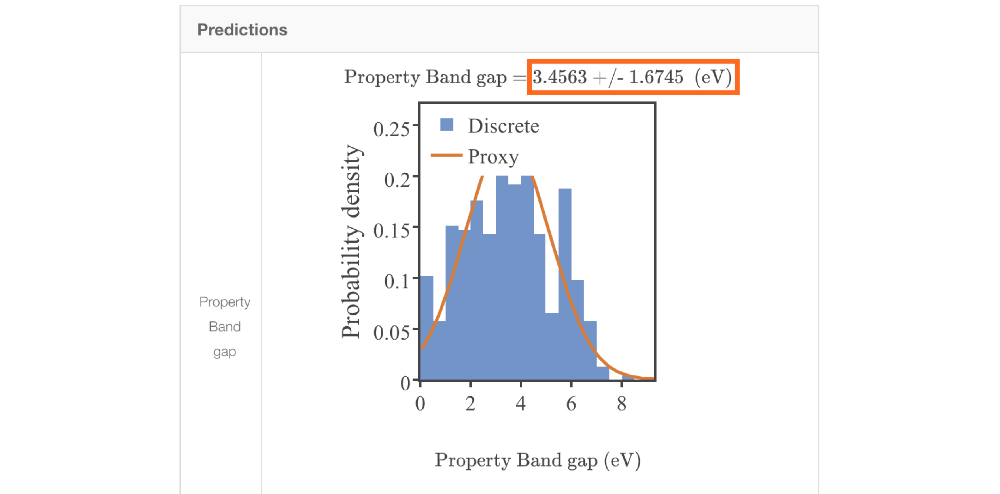
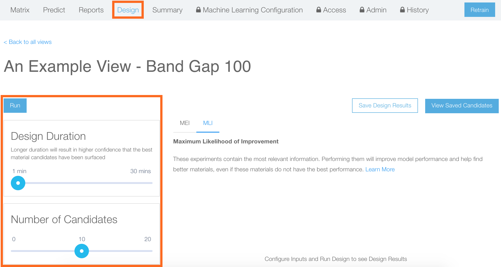
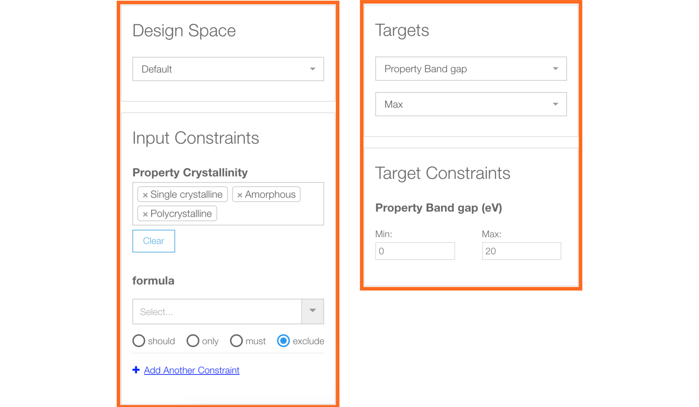
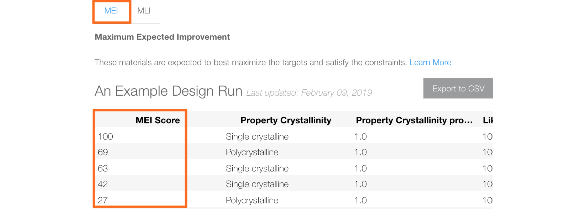
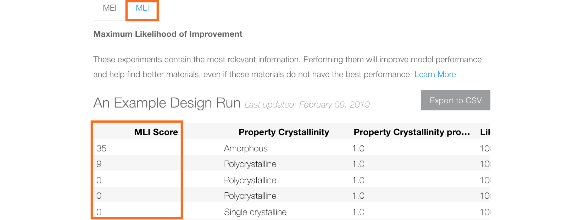
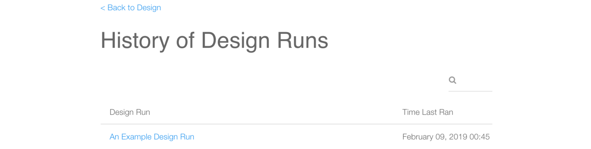

# Predict and Design
*Authors: Enze Chen*

In this document, we will cover how to use the Predict and Design endpoints on the Citrination web UI. These services are core elements of [Citrine's sequential learning framework](https://citrine.io/platform/sequential-learning/). They are enabled once you have constructed a machine learning (ML) model and they can be accessed from each data view.

## Learning outcomes
After reading this guide, you should feel comfortable with:
* Making predictions with the UI.
* Setting design parameters with the UI.
* Finding the best performing materials and the best experiments to perform next.

## Background knowledge
To get the most out of this guide, it is helpful to be familiar with:
* How to train [ML models](06_machine_learning.md) in Citrination.
* [Uncertainty quantification](https://arxiv.org/pdf/1704.07423.pdf) in Citrination.

## Predict
If you open your [Data View](03_data_views.md) and have [ML configured](06_machine_learning.md), then you will see **Predict** in your View menu options. Clicking on that will take you to the following page:

Here you can request predictions for new materials by supplying inputs to the the model you trained. You will see an input option corresponding to each input variable you had previously selected. Let's try to make a prediction for single crystalline boron nitride (BN).

You should get an output that resembles the one above. The exact values will differ due to the randomness in the ML model. It's important to know that the value and uncertainty of the prediction appear at the top. The plot gives a visual representation for how these numbers were obtained. Namely, samples were drawn from the distribution of material properties and the orange curve was fit to these samples; the final prediction is the mean and standard deviation of this orange curve.

## Design
The second menu option in data views that now appears is **Design**, which enumerates a list of candidate materials for you.

At the top, the "Run" button is highlighted in blue—but before we press that, we have to set the design configurations.

### General settings
* **Design Duration**: How long to run the search for new materials. Intuitively, a longer time results in a higher chance of finding the best materials as more resources are allocated. We'll just choose `1 minute` for demonstration.
* **Number of Candidates**: The number of top candidate materials to keep in the final list. This shouldn't affect the design time, only how many results you care to display. We'll keep this at `10`.

### Input settings
* **Design Space**: What types of materials to search over. `Default` generates new candidates based on the data view while `This view` restricts the search space to only those materials that already appear in the data view (but might be missing outputs). We'll choose `Default`.
* **Input Constraints**: These constraints further limit the design space. For categorical variables, you can select which categories you want the design endpoint to consider. For an input formula, you can combine logic with chemical formulas to filter specific elements. We'll include all options.

### Output settings
* **Targets**: Select which property you are designing materials for and for what goal (`Min`, `Max`, or a specific `Value`). We will use `Max` in this example.
* **Target Constraints**: These constraints further limit the design space by setting restrictions on what values the *predicted* output can take. Candidates that are predicted to have values outside of this range will *not* appear. We'll set this range from `0` to `20`.

### Design results
There are two sets of candidates returned from the design process. The first set, **Maximum Expected Improvement (MEI)**, lists materials in ranked order of the materials expected to best maximize the targets and satisfy the constraints. The name comes from the fact that these candidates have a mean predicted value that is higher than that of all other candidates. The "MEI Score" isn't particularly important other than establishing a ranking. If you scroll to the right, you will see the chemical formula along with the predicted values and uncertainty. You will want to look for candidates with a non-zero uncertainty, since those are new candidates that don't appear in the training data.

The second set of materials, **Maximum Likelihood of Improvement (MLI)**, selects candidates most likely to have a higher target value than the best previously measured material, after the uncertainty has been taken into account (for a more in-depth discussion, see [this paper](https://arxiv.org/pdf/1704.07423.pdf)). The results table that is generated can be interpreted similarly to the first one. These are the candidate materials one might want to run experiments on next as part of the [sequential learning](https://citrine.io/platform/sequential-learning/) framework.

Finally, at the top right of the page, you have the option of saving design results. You can then click "View Saved Candidates" at a later date and access your history of saved design runs for reference or further optimization.

## Conclusion

This wraps up our discussion of the Predict and Design interfaces on the Citrination UI. At this point, you should feel comfortable with:
* Making predictions with the UI.
* Setting design parameters with the UI.
* Finding the best performing materials and the best experiments to perform next.

If you have further questions, please do not hesitate to [Contact Us](https://citrine.io/contact/).
